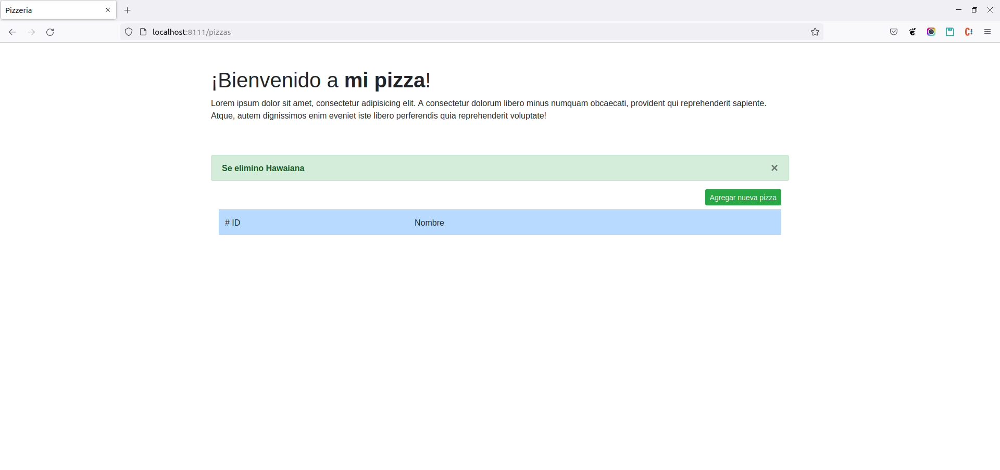

## Instalacion
#### dependencias
* docker

Posterior a descargar el proyecto, es posible ejecutar desde el archivo "run.sh" dentro de la raíz del proyecto.

```sh
sudo chmod +x ./run.sh
```

Como se puede apreciar únicamente es necesario darle permisos al archivo indicado, de otra manera será necesario configurarlo
con alguna otra herramienta como xampp.

No es necesario ejecutar ningún comando mas ya que el script se encarga de correr instalación de composer, migrations y seeders

## CRUD Pizza

### Create


### Retrieve


### Update


### Delete

